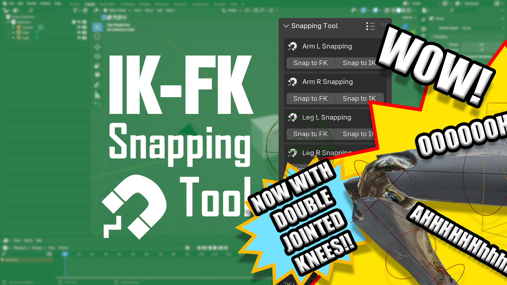

# IK-FK Snapping Tool WITH KNEES!

## Introduction
IK-FK Snapping Tool is a simple Blender add-on that lets you match poses between IK/FK controls. The original add-on is a fork version of the [IK-FK Snapping](https://github.com/Mystfit/IK-FK-Snapping-for-Blender) add-on by [Mystfit](https://github.com/Mystfit) that adds additional snapping options and improved UI. THIS addon is forked from the [Endertainer's version](https://github.com/Endertainer/IK-FK_Snapping_Tool) in order to add an additional knee bone between the upper and lower leg bones.

With this tool, you can easily snap from IK to FK and FK to IK with just a press of a button. This add-on also allows you to save presets that enable you to switch from one snapping preset to another.

## How to use?
- Make sure that your rig is selected.
- Fill the bone input fields with the corresponding bones. For example, FK Upper with CTL-Arm_Upper.FK.L, FK Lower with CTL-Arm_Lower.FK.L, FK End with CTL-Wrist.FK.L, IK Control with CTL-Arm_IK.L, IK Pole with CTL-Arm_Pole.L, etc (note that if your rig doesn't have the IK Target and IK Pole Target bone, you need to add one yourself. You can do this by duplicating the IK Control and IK Pole bone, changing the bone shape to something else, and parent it to the FK lower bone).
- Open the preset menu by clicking an icon on the add-on panel header (the one with the dots and stripes).
- Set a name for your snapping preset and save it by clicking the + icon.

If you encounter a bug or problems with the arms, you can raise an [issue](https://github.com/Endertainer/IK-FK_Snapping_Tool/issues/new) on the Github repository or join my [Discord](https://discord.com/invite/Xk7RxPq9R5) server. For the legs, reach out to PixelTaku on GitHub or BlueSky.

## Please Note
I (PixelTaku) made this for a specific rig I was working on and needed some specific functionality with my IK-FK snapping. It should work in theory if you have a similar rig. I don't intend to work on it beyond what I need for that rig for now, but the code base could be generalized to support non-double kneed rigs again (I just swapped the function out basically) and a rig without tweak bones with some basic branching checks. (You can technically just pass in the regular IK bones for the tweaks if you just have the 3 bone setup, I guess, but allowing the fields to be blank would be a nice feature). We'll see how far I get.

# The Compatible Rig Setup

There are 3 leg rigs overall. The base <b>def</b>ormation bones (the bones that the geometry are weighted on) include a thigh, knee, shin, foot, and toe bone. The <b>FK</b> setup has the same bones as the DEF bones, just differently named. The <b>IK</b> setup is slightly more complex, using a combination of MCH bones and MCH_Parent bones to allow for smooth stretching/disconnecting of the limbs. I followed these two tutorials for the most part:

- https://www.youtube.com/watch?v=JBIdruWylDQ

- https://youtu.be/xEnu_EsnzjI?si=MNFfsbsp1pSkXG2c

I also added two tweak bones on the top of the knee and the shin to address knee popping. The feet rig is also more complicated, with added foot roll and toe wiggle controls, but these aren't used in the IK-FK snapping function.

