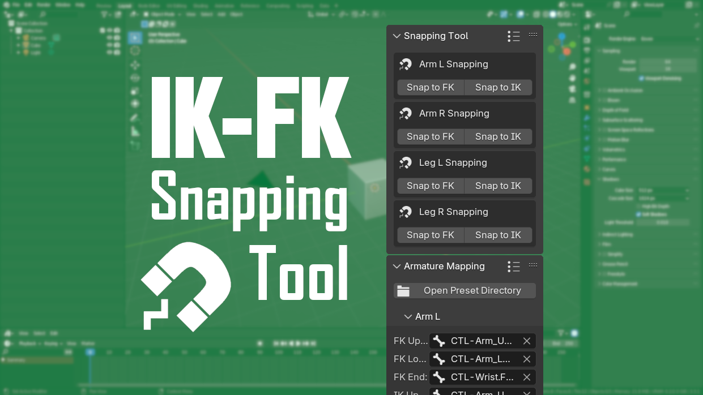

# IK-FK Snapping Tool   

## Introduction
IK-FK Snapping Tool is a simple Blender add-on that lets you match poses between IK/FK controls. This add-on is a forked version of the original IK-FK Snapping add-on by [Mystfit](https://github.com/Mystfit).

With this tool, you can easily snap from IK to FK and FK to IK with just a press of a button. This add-on also allows you to save presets that enable you to switch from one rig to another.

## Instruction
- To start using the add-on, install the IK-FK_Snapping_Tool.zip file.
- In the viewport, go to the Sidebar > IK-FK Snap tab.
- In the Armature & Bones panel, enter the name of the Armature you want to target in the Armature field (Note that add-on uses the Armature name, not the Object name).
- Fill the rest of the Bone field. What you fill the field with depends on what you want to snap. For example, if you want to snap the Left Arm, then you'll fill it like this: FK Upper = Shoulder_FK_L, FK Lower = Elbow_FK_L, FK End = Wrist_FK_L, IK Upper = Shoulder_IK_L, IK Lower = Elbow_IK_L, IK End = Wrist_IK_L, IK Effector = Arm_IK_Control_L, IK Pole = Arm_IK_Pole_L, IK Target = Arm_IK_Target_L, IK Pole Target = Arm_IK_Pole_Target_L.
- Once you set up all of the bones, you can use the Limb presets button in the upper right corner of the Armature & Bones panel or the Snapping Tool panel to create a preset. You can also switch your presets here (Note that if you want to change a bone or rename a preset, you need to delete and remake it from scratch).
- To do the snapping, click Snap to FK to snap the IK control to FK or Snap to IK to snap the FK control to IK.

If you need help, you can join my [Discord](https://discord.com/invite/vANwCrPPBu) server.
